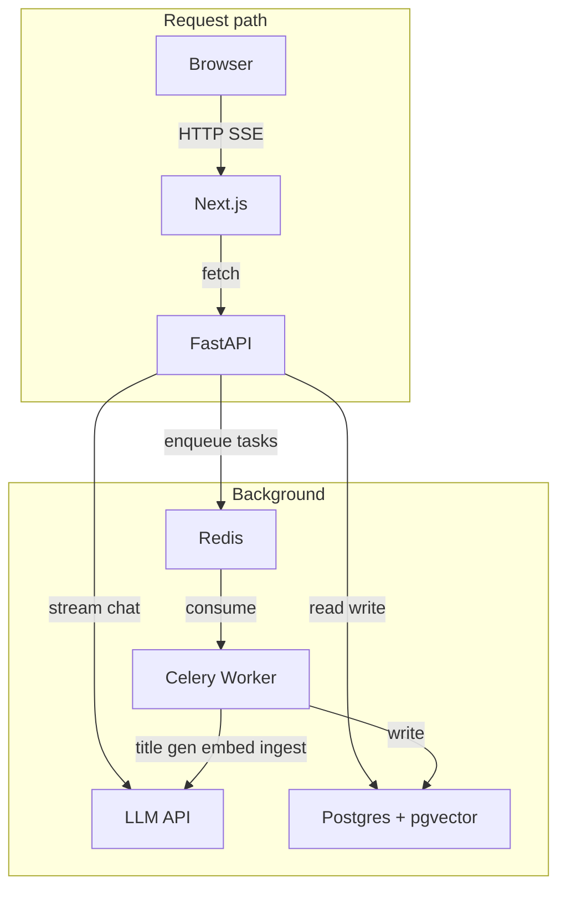

# hax

AI-first product: primary interface is a **chat experience** that answers user questions using the user's own data and context. This repo is **v0** — an open-source skeleton that ships the full vertical slice. When v0 is done, no further code is added here; a private repo forks from it for v1+ (domain agents, advanced UI, proprietary features).

## Goal (v0)

- Chat produces a direct answer grounded in the user's data, a short explanation of what data was used, and structured output (e.g. tables) when helpful.
- User can sign in, provide or connect data, ask questions in chat, and see results in table/structured view.
- Product feels cohesive; we can add data sources, question types, and agent capabilities without rewriting everything.

**Non-goals:** perfect agent autonomy, over-optimized architecture, full enterprise compliance. **Principles:** working software over perfect abstractions; minimal testable vertical slices; treat user data as sensitive.

## Stack

| Layer   | Tech |
|---------|------|
| Frontend | Next.js (SSR + routing), React, TypeScript |
| Backend  | FastAPI, LangChain |
| Streaming | SSE (FastAPI `StreamingResponse`) for chat |
| Async    | Celery + Redis (broker + cache) |
| Data     | Postgres + pgvector (embeddings) |
| Types    | OpenAPI spec → generated TypeScript (e.g. openapi-typescript) |
| Infra    | Docker, docker-compose |

## Build milestones (v0)

1. **Streaming chat** — Next.js + FastAPI + SSE, conversation history in Postgres, basic auth, background chat title generation (Celery + Redis), Docker Compose (Postgres, Redis, all services).
2. **Data + RAG** — User data upload (files), ingestion (chunk → embed → pgvector) via Celery, RAG in chat, conversation memory with user data context.
3. **Structured outputs + polish** — Table/structured view for results, citation/source display, cohesive UI.

## Architecture (v0)

- Chat responses stream (SSE) directly from FastAPI to the browser; they are not queued through Celery.
- Celery + Redis handle background work: title generation, data ingestion, embedding, index rebuilds.
- pgvector lives in Postgres; no separate vector DB.
